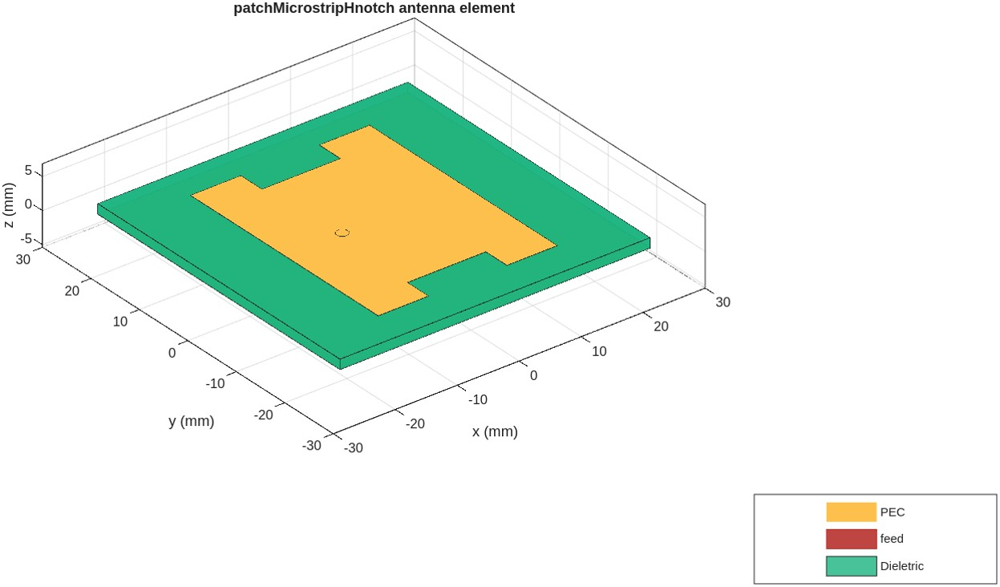
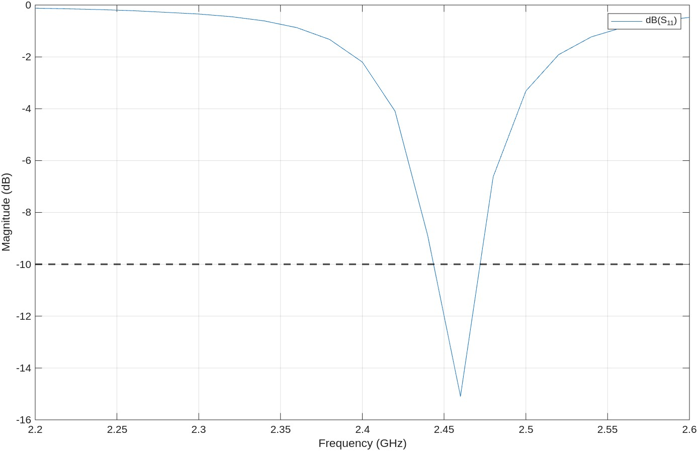
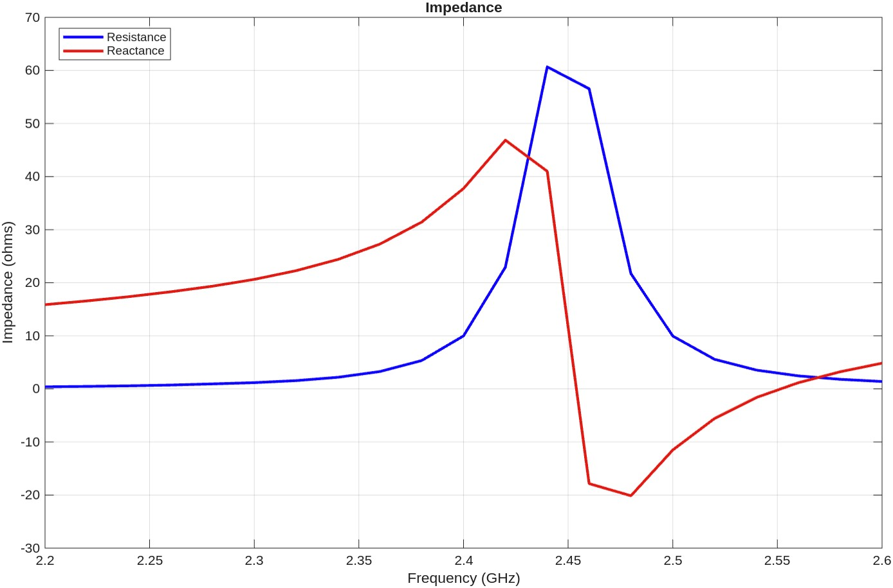
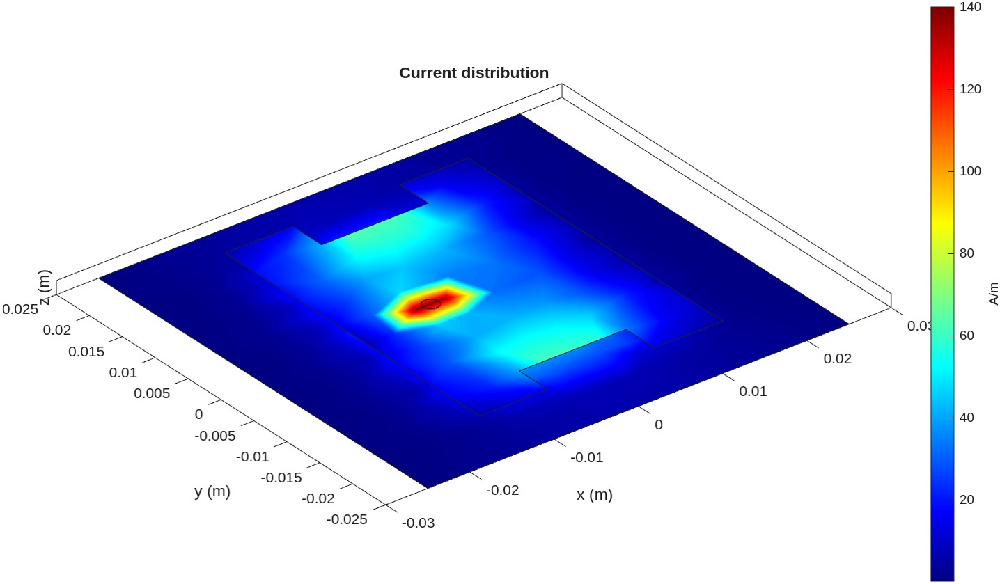
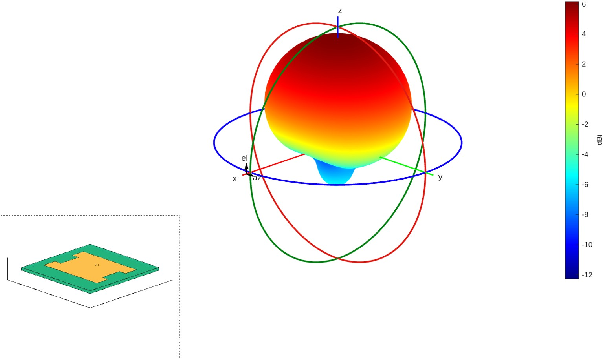
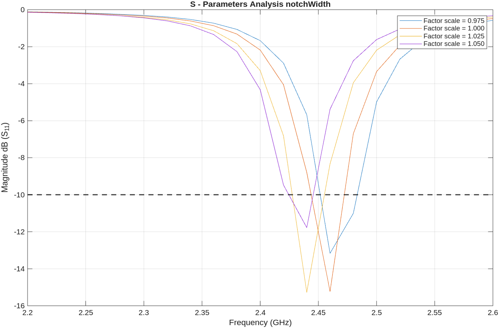
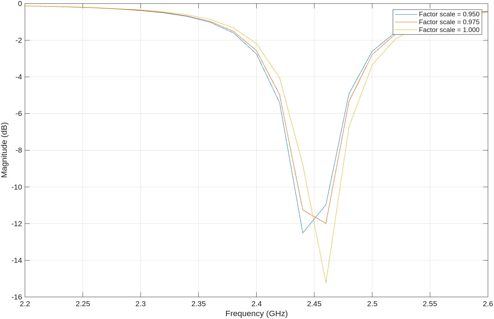
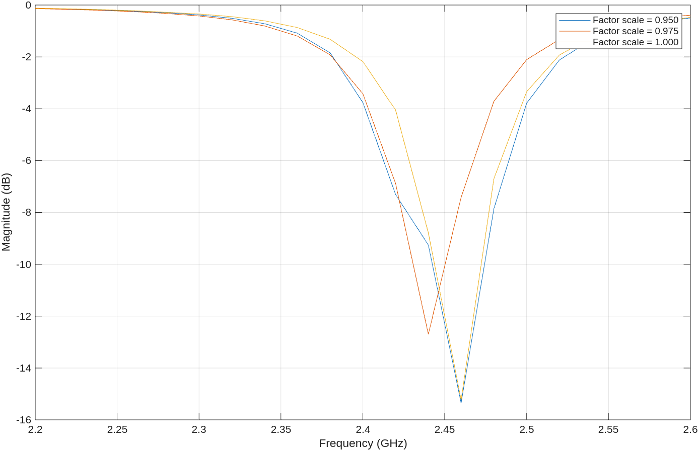

# patch-hnotch-antenna
# H-Notch Microstrip Patch Antenna

Design and parametric analysis of a coaxial-fed H-notch microstrip patch antenna
resonating at 2.4 GHz (WiFi band), implemented in MATLAB Antenna Toolbox.

The H-notch topology reduces the radiating element size compared to a conventional
rectangular patch, while maintaining resonance at the target frequency.
A correction factor α = 2.3/2.4 is applied to patch length and notch length
to shift the simulated resonance from 2.3 GHz to exactly 2.4 GHz.

---

## Antenna Model

---

## Antenna Parameters

| Parameter        | Value          |
|------------------|----------------|
| Resonance freq.  | 2.4 GHz        |
| Substrate (εr)   | 4.2            |
| Substrate height | 1.52 mm        |
| Patch L × W      | 28.9 × 38.7 mm |
| Notch L × W      | 12.7 × 4.4 mm  |
| Ground plane     | 50 × 50 mm     |
| Feed impedance   | 50 Ω (coaxial) |
| S11 @ 2.4 GHz    | −14.7 dB       |
| Directivity      | 6.13 dBi       |

---

## Simulation Results

### S11 — Baseline Design
> Resonance at 2.4 GHz with S11 = −14.7 dB, well below the −10 dB threshold.

---

### Input Impedance
> Resistance peaks near resonance. Reactance crosses zero at the resonance
> frequency, confirming correct impedance matching at 2.4 GHz.

---

### Current Distribution @ 2.4 GHz
> Current density is highest near the feed point and around the notch edges,
> confirming the expected resonant behavior of the H-shaped patch.

---

### Radiation Pattern 3D @ 2.4 GHz
> Main lobe along +z direction (broadside). A secondary lobe is visible
> along −z due to the finite ground plane size.

---

## Parametric Analysis

Parametric sweep performed on all four geometric parameters (±5% from baseline,
5 steps). Each parameter is varied independently while the others are held constant.

### Notch Width Sweep
> Frequency shifts slightly with notch width. Smaller notch width moves
> resonance toward higher frequencies. Power peaks at the central frequency.

### Patch Width Sweep
> Width variation has limited effect on resonance frequency. Curves remain
> clustered near 2.4 GHz. Power peaks at the central frequency across all configurations.

### Patch Length Sweep
> Increasing patch length shifts resonance toward lower frequencies.
> Power level remains stable across the sweep, with peak always near the
> central frequency.

